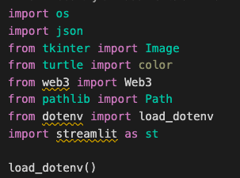

# Project-3

## Our Task: 

We are a new project team within Enterprise rent a car tasked with trying exploring ways to utilize tokens in order to drive growth in our subscription service. Our strategy will be to create three classes of tokens signifying different levels of subscription for standard, upgraded, and premium. Then create a book of service offerings for each class of token. Finally, we are to develop a marketing strategy for these products within the Philadelphia test market.

This analysis included the following steps:

1. Create example Tokens for the three leves of subscripting 
    * Code the XP_Token. XP_TokenCrowdsale, and XP_TokenCrowdsaleDeployer Contracts
    * Compile and Deploy contracts Using Injected web3 & Meta Mask
    * Copy the ABI of copiled contacts into a sperate .json file 
    * copy the SMART_CONTRACT_ADDRESS and WEB3_PROVIDER_URI into a .env inorder to connect contracts to the front end completed in step 2 
2. Display the tokens by creating a front end display using app.py file 
    * Connect to XP_TokenCrowdsale by importing the SMART_CONTRACT_ADDRESS, WEB3_PROVIDER_URI, and .json file 
    * Code front end display 
    * Run Streamlit on computer terminal to display finalized from end 
4. Analyze Pennsylvania Census Data to consider marketing plan for the tokenized subscription service.


### Step 1:Code the XP_Token. XP_TokenCrowdsale, and XP_TokenCrowdsaleDeployer Contracts

1. Inside the `XPTokenMintable.sol` file, find the code that creates the `XP_Token` contract. Remove the `mint` function from the main body of the constructor. (The `XP_TokenCrowdsale` contract will handle this functionality.)

2. Open the `XPTokenCrowdsale.sol` file, and then add the following `pragma` line and `import` statements:

    ```solidity
    pragma solidity ^0.5.0;

    import "./XPTokenMintable.sol";
    import "https://github.com/OpenZeppelin/openzeppelin-contracts/blob/release-v2.5.0/contracts/crowdsale/Crowdsale.sol";
    import "https://github.com/OpenZeppelin/openzeppelin-contracts/blob/release-v2.5.0/contracts/crowdsale/emission/MintedCrowdsale.sol";
    ```

3. Inside the `XP_TokenCrowdsale` contract, which inherits the OpenZeppelin `Crowdsale` and `MintedCrowdsale` contracts, complete the following steps:

    * Create a constructor function that includes the following three parameters:

      -`uint rate`: The conversion rate between the wei and the `XP_Token`.

      -`address payable wallet`: The beneficiary of the crowdsale, or the contract owner/

      -`XP_Token token`: The `XP_Token` itself, which the `XP_TokenCrowdsale` will work with.

    * Create the `Crowdsale` constructor, which takes these three parameters: `rate`, `wallet`, and `token`. Make this constructor public.

    * Create the body of the constructor function with the following code:

      ```solidity
      {
          // constructor can stay empty
      }
      ```

      Note that the body of the constructor can stay empty because the `Crowdsale` constructor handles the minting functionality.

4. Just after the `XP_TokenCrowdsale` contract, find a second contract named `XP_TokenCrowdsaleDeployer`. Add variables to store the addresses of the `XP_Token` and `XP_TokenCrowdsale` contracts, which this contract will deploy. To do so, complete the following steps:

    * Create an `address public` variable named `xp_token_address`. This variable will store the address of `XP_Token` once that contract has been deployed.

    * Create an `address public` variable named `xp_crowdsale_address`. This variable will store the address of `XP_TokenCrowdsale` once that contract has been deployed.

5.  Within the constructor in the provided starter code, create a new instance of the `XP_Token` contract. Assign the address of the token contract to the `xp_token_address` variable. (This will allow you to fetch the address of the token later.) To complete this step, use the following code: 


    ```solidity
    XP_Token token = new XP_Token(name, symbol, 0);
    xp_token_address = address(token);
        ```

6. Create a new instance of the `XP_TokenCrowdsale` contract. Set the `rate` parameter to 1 to maintain parity with ether.
  Pass in the `wallet` parameter from the main constructor. (This is the wallet that will get paid any ether that the `XP_TokenCrowdsale` raises.) For the `token` parameter, use the `token` variable that stores `XP_Token`.

    Here’s the code that results from these settings:

    ```solidity
    XP_TokenCrowdsale xp_crowdsale = new XP_TokenCrowdsale(1, wallet, token);
    ```

7. Use the following code to assign the address of the `XP_TokenCrowdsale` contract to the `xp_crowdsale_address` variable (this will allow you to fetch the address of the crowdsale later):

     ```solidity
     xp_crowdsale_address = address(xp_crowdsale);
     ```

8. Set the `XP_TokenCrowdsale` contract as a minter, and then renounce mintership from the `XP_TokenCrowdsaleDeployer` contract by using the following code (recall that you removed the `mint` function from the `XP_Token` constructor in an earlier step):

    ```solidity
    token.addMinter(xp_crowdsale_address);
    token.renounceMinter();
    ```

9. In the Remix IDE, navigate to the **Solidity compiler** pane.

10. In the Compiler drop-down list, select any version from 0.5.0 to 0.5.17. Compile both the `XPTokenMintable.sol` and `XPTokenCrowdsale.sol` files. Check for any errors, and debug them as needed.

11. Copy the ABI of the `XPTokenCrowdsale.sol` to a seperate .json file 

### Deploy the XP_Token Crowdsale

In this section, you’ll deploy the `XP_TokenCrowdsaleDeployer`, `XP_TokenCrowdsale`, and `XP_Token` contracts.

Before deploying the contracts, make sure that you’ve launched Ganache and loaded 1 accounts into Remix and load the WEB3_PROVIDER_URI into the .env file.

To deploy the contracts, complete the following steps:

1. In the Remix IDE, navigate to the **Deploy & Run Transactions** pane, and then complete the following steps:

    * Select an address from MetaMask that you’ll use to deploy the contracts.

    * Copy the address to the clipboard.

    * Select the `XP_TokenCrowdsaleDeployer` contract, and then fill in the values for **Name** and **Symbol**. Paste the address from the clipboard into the **Wallet** box.

    * Click **transact**, and when the MetaMask dialog box opens, confirm the transaction.

2. Copy the smart contract address = SMART_CONTRACT_ADDRESS into a .env file

### 2. Design front end Display in a app.py file 

1. Load Imports 



2. Set background using the set_background_url() function

3. Define and connect a new Web3 provider 

4. Load contracts
    
    * Load the contract ABI
    * Set the contract address (this is the address of the deployed contract)
    * Get the contract

5. Front End Display
6. Load in Enterprise Logo 
7. Creat a Title, Subscription Service Description, Subscription Benifits, How It Works
8. Input Wallet Address 
    * Using "accounts = w3.eth.accounts" create area for customers to input thier wallet address to exchange ETH for our tokens 
9. Decription of Economy Token
10. Decription of Full Size Token
11. Decription of Luxury Token
12. Save file in the same location as the .env & .json files created in step 1. 
13. Open Terminal and navigate to location of saved app.py, .env, and ABI.json file 
14. In terminal run "Streamilt run app.py" 

15. Front end will be displayed in web browser
