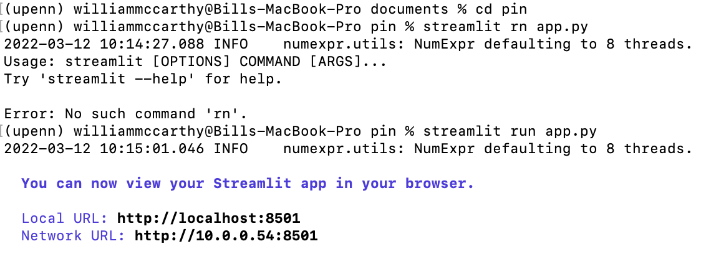
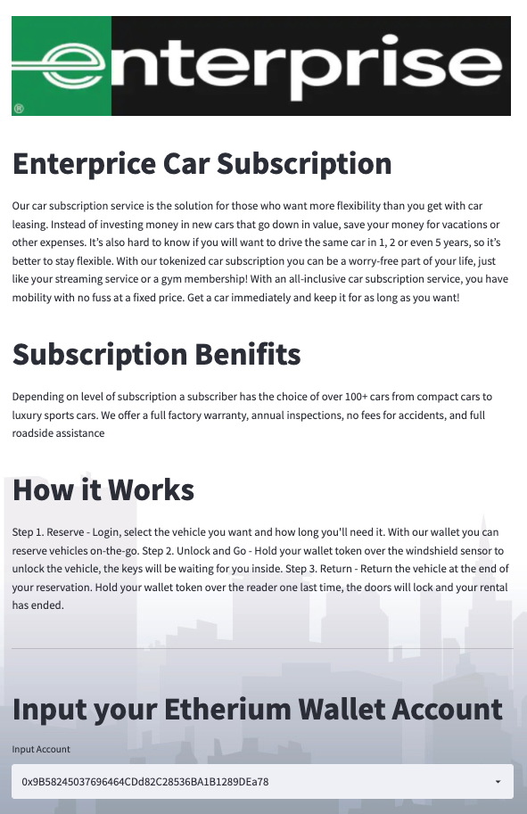
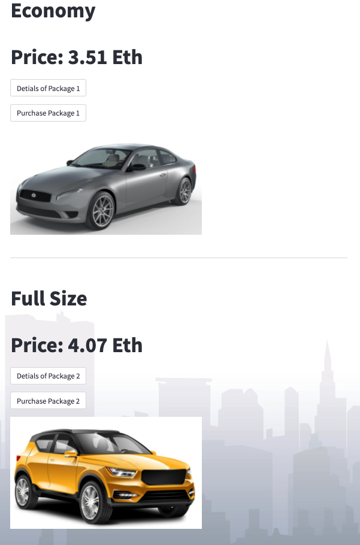
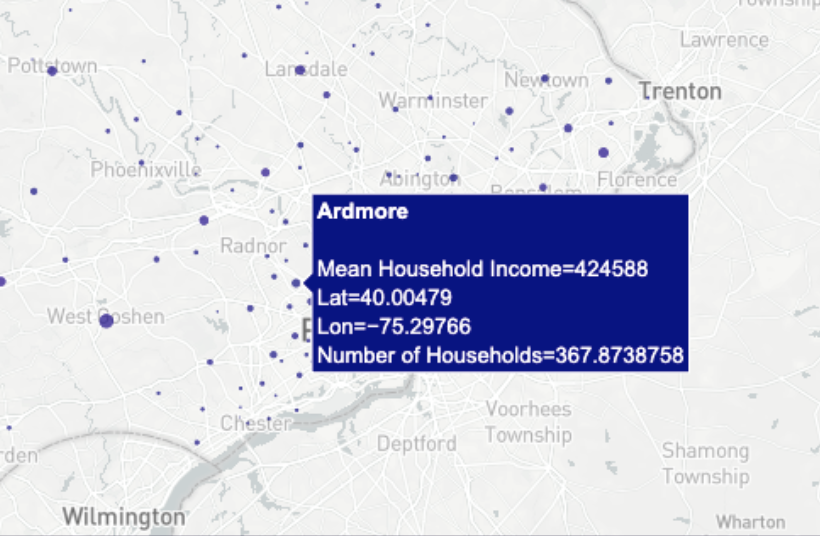
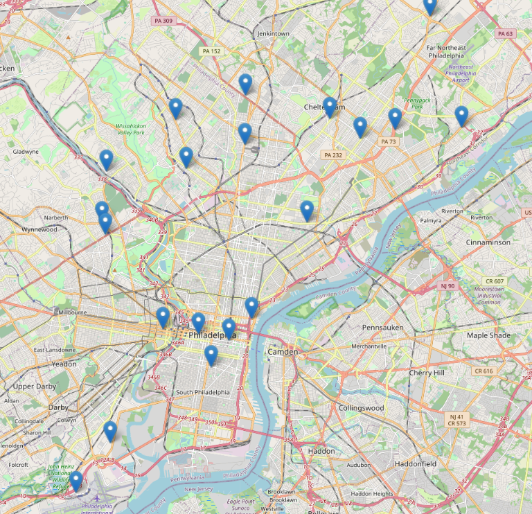

# Project-3

Presentation link:

https://docs.google.com/presentation/d/1h0pZK-jXZjNnL0XjGncY-2LptL8qETUH/edit?usp=sharing&ouid=106684414815156550820&rtpof=true&sd=true

---

## Our Task

We are a new project team within Enterprise rent a car tasked with trying exploring ways to utilize tokens in order to drive growth in our subscription service. Our strategy will be to create three classes of tokens signifying different levels of subscription for standard, upgraded, and premium. Then create a book of service offerings for each class of token. Finally, we are to develop a marketing strategy for these products within the Philadelphia test market.

This analysis included the following steps:

1. Create example Tokens for the three leves of subscripting 
    * Code the XP_Token. XP_TokenCrowdsale, and XP_TokenCrowdsaleDeployer Contracts
    * Compile and Deploy contracts Using Injected web3 & Meta Mask
    * Copy the ABI of copiled contacts into a sperate .json file 
    * copy the SMART_CONTRACT_ADDRESS and WEB3_PROVIDER_URI into a .env inorder to connect contracts to the front end completed in step 2 
2. Display the tokens by creating a front end display using app.py file 
    * Connect to XP_TokenCrowdsale by importing the SMART_CONTRACT_ADDRESS, WEB3_PROVIDER_URI, and .json file 
    * Code front end display 
    * Run Streamlit on computer terminal to display finalized from end 
3. Gather and analyze Philadelphia market data in order to develop a successful marketing strategy
4. Results, Conclusions, & Next Steps 

---

### Part 1:Code the XP_Token. XP_TokenCrowdsale, and XP_TokenCrowdsaleDeployer Contracts

Location: XPTokenMintable.sol & XPTokenCrowdsale.sol
Please note that the starter code & instructions are sourced from class activity 04-Stu_XP_Token_Crowdsale

1. Inside the `XPTokenMintable.sol` file, find the code that creates the `XP_Token` contract. Remove the `mint` function from the main body of the constructor. (The `XP_TokenCrowdsale` contract will handle this functionality.)

2. Open the `XPTokenCrowdsale.sol` file, and then add the following `pragma` line and `import` statements:

    ```solidity
    pragma solidity ^0.5.0;

    import "./XPTokenMintable.sol";
    import "https://github.com/OpenZeppelin/openzeppelin-contracts/blob/release-v2.5.0/contracts/crowdsale/Crowdsale.sol";
    import "https://github.com/OpenZeppelin/openzeppelin-contracts/blob/release-v2.5.0/contracts/crowdsale/emission/MintedCrowdsale.sol";
    ```

3. Inside the `XP_TokenCrowdsale` contract, which inherits the OpenZeppelin `Crowdsale` and `MintedCrowdsale` contracts, complete the following steps:

    * Create a constructor function that includes the following three parameters:

      -`uint rate`: The conversion rate between the wei and the `XP_Token`.

      -`address payable wallet`: The beneficiary of the crowdsale, or the contract owner/

      -`XP_Token token`: The `XP_Token` itself, which the `XP_TokenCrowdsale` will work with.

    * Create the `Crowdsale` constructor, which takes these three parameters: `rate`, `wallet`, and `token`. Make this constructor public.

    * Create the body of the constructor function with the following code:

      ```solidity
      {
          // constructor can stay empty
      }
      ```

      Note that the body of the constructor can stay empty because the `Crowdsale` constructor handles the minting functionality.

4. Just after the `XP_TokenCrowdsale` contract, find a second contract named `XP_TokenCrowdsaleDeployer`. Add variables to store the addresses of the `XP_Token` and `XP_TokenCrowdsale` contracts, which this contract will deploy. To do so, complete the following steps:

    * Create an `address public` variable named `xp_token_address`. This variable will store the address of `XP_Token` once that contract has been deployed.

    * Create an `address public` variable named `xp_crowdsale_address`. This variable will store the address of `XP_TokenCrowdsale` once that contract has been deployed.

5.  Within the constructor in the provided starter code, create a new instance of the `XP_Token` contract. Assign the address of the token contract to the `xp_token_address` variable. (This will allow you to fetch the address of the token later.) To complete this step, use the following code: 


    ```solidity
    XP_Token token = new XP_Token(name, symbol, 0);
    xp_token_address = address(token);
        ```

6. Create a new instance of the `XP_TokenCrowdsale` contract. Set the `rate` parameter to 1 to maintain parity with ether.
  Pass in the `wallet` parameter from the main constructor. (This is the wallet that will get paid any ether that the `XP_TokenCrowdsale` raises.) For the `token` parameter, use the `token` variable that stores `XP_Token`.

    Here’s the code that results from these settings:

    ```solidity
    XP_TokenCrowdsale xp_crowdsale = new XP_TokenCrowdsale(1, wallet, token);
    ```

7. Use the following code to assign the address of the `XP_TokenCrowdsale` contract to the `xp_crowdsale_address` variable (this will allow you to fetch the address of the crowdsale later):

     ```solidity
     xp_crowdsale_address = address(xp_crowdsale);
     ```

8. Set the `XP_TokenCrowdsale` contract as a minter, and then renounce mintership from the `XP_TokenCrowdsaleDeployer` contract by using the following code (recall that you removed the `mint` function from the `XP_Token` constructor in an earlier step):

    ```solidity
    token.addMinter(xp_crowdsale_address);
    token.renounceMinter();
    ```

9. In the Remix IDE, navigate to the **Solidity compiler** pane.

10. In the Compiler drop-down list, select any version from 0.5.0 to 0.5.17. Compile both the `XPTokenMintable.sol` and `XPTokenCrowdsale.sol` files. Check for any errors, and debug them as needed.

11. Copy the ABI of the `XPTokenCrowdsale.sol` to a seperate .json file 

---

### Step 2: Deploy the XP_Token Crowdsale

In this section, you’ll deploy the `XP_TokenCrowdsaleDeployer`, `XP_TokenCrowdsale`, and `XP_Token` contracts.

Before deploying the contracts, make sure that you’ve launched Ganache and loaded 1 accounts into Remix and load the WEB3_PROVIDER_URI into the .env file.

To deploy the contracts, complete the following steps:

1. In the Remix IDE, navigate to the **Deploy & Run Transactions** pane, and then complete the following steps:

    * Select an address from MetaMask that you’ll use to deploy the contracts.

    * Copy the address to the clipboard.

    * Select the `XP_TokenCrowdsaleDeployer` contract, and then fill in the values for **Name** and **Symbol**. Paste the address from the clipboard into the **Wallet** box.

    * Click **transact**, and when the MetaMask dialog box opens, confirm the transaction.

2. Copy the smart contract address = SMART_CONTRACT_ADDRESS into a .env file

---

### Part 3: Design front end Display in a app.py file 

Location: app.py

1. Load Imports 


2. Set background using the set_background_url() function

3. Define and connect a new Web3 provider 

4. Load contracts
    
    * Load the contract ABI
    * Set the contract address (this is the address of the deployed contract)
    * Get the contract

5. Front End Display
6. Load in Enterprise Logo 
7. Creat a Title, Subscription Service Description, Subscription Benifits, How It Works
8. Input Wallet Address 
    * Using "accounts = w3.eth.accounts" create area for customers to input thier wallet address to exchange ETH for our tokens 
9. Decription of Economy Token
10. Decription of Full Size Token
11. Decription of Luxury Token
12. Save file in the same location as the .env & .json files created in step 1. 
13. Open Terminal and navigate to location of saved app.py, .env, and ABI.json file 
14. In terminal run "Streamilt run app.py" 

15. Front end will be displayed in web browser
 



---

### Gather and Analyze Philadelphia Market Data in Order to Develop a Successful Marketing Strategy

Location: PA Household Income by City.ipynb

1. Import Libraries & Depencencies, Load .env variables, Set alpaca key and Secret key
2. Loadin in Census Data sourced from Kaggle
3. Creat a Mapbox Plot to visulatize the Market Data.


Location: enterprise_locations_philly.ipynb.

1. Creat Dataframe of enterprise loactions
2. Import googlemaps and convert addresses to latitude and longitude points 
3. Define the airport address 
4. load imports for mapp 
5. Use matplotlib to create a chart of enterprise locations relative to the Philadelphia airport



Test Market Justification: 

Given the area’s proximity to a major international airport Philadelphia is an idea market to test our service in 
1. The surrounding area contains a wide variety of customers. As well as a concentration of our target customers in center city and the surrounding affluent suburbs 
2. Philadelphia is a major hub for business travel. this presents an opportunity to market as the premier business car rental partner or  as a potential fleet replacement service
---

Marketing Strategy 

Marketing to millennials and Gen Z
Seven out of ten millennials and GenZ’ers want their image to represent the “real me”*
Transparency of what/why we’re offering
No hidden fees
“The car rental industry is witnessing massive growth mainly because of the increase in the disposable income of consumers followed by the influence of high standard of living and spending more on luxury vehicles for travel” 

They’re digital natives
we’re going to target social media

Humanize the brand
“Almost half of millennials and GenZ’ers like to know the backstory or brands and products”* 
Make the message short, to the point, and in their language 


---

Results & Conclusions

* High car demand
* Low car ownership in millennials
* Ease of access
* Rental car industry has had rapid growth due to rise in urban population and tourism
“Offer more effective and efficient services to customers in the future, car rental companies are looking forward to car rental management software, as it helps in minimizing repetitive tasks and exhibit concentration on developing new business models and strategies”* 
* Increasing implementation of rental car management software offer huge opportunities in the forecast period

----

Next Steps 

With additional time and resources we could: 

* Design a better user interface 
* Create our own exchange or digital currency 
* Launching a series of NFTs 
* A connection to Opensea as a secondary market for NFT trades
* NFT can earn you a vehicle in the metaverse as Enterprise tries to expand their market share and partner with Decentraland
* Would be able to lease the vehicle to other users in the metaverse 


